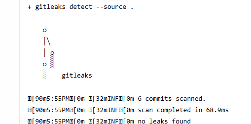
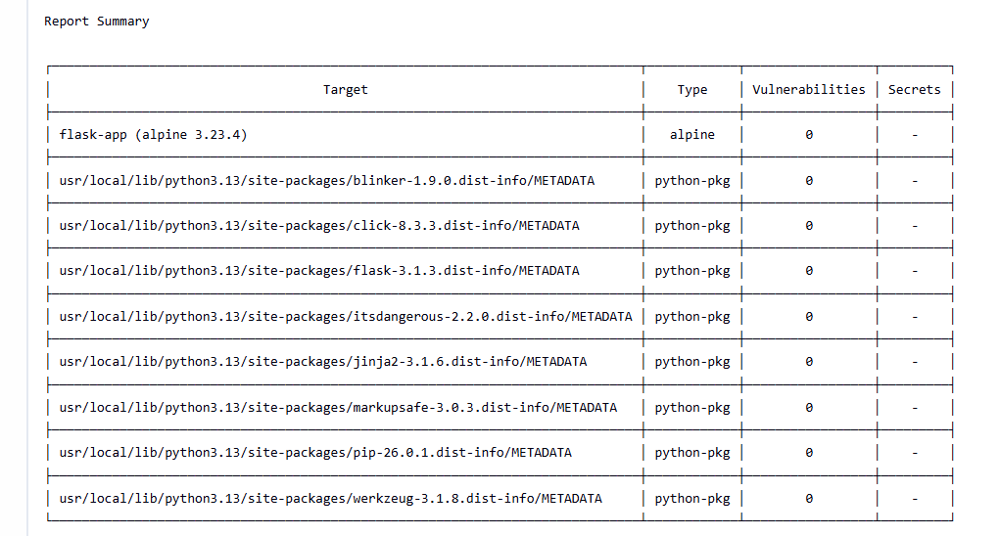

# 🔐 Secure CI/CD Pipeline with SAST, Secret Scanning & Kill Switch

---

## Why I built this

After completing my first DevSecOps pipeline with Jenkins, Docker and Trivy, I wanted to go deeper. One tool scanning images wasn't enough — I wanted security at every single stage of the pipeline. So I added Gitleaks for secret detection, SonarQube for static code analysis, and a kill switch that stops deployment the moment a HIGH or CRITICAL vulnerability is found.

This isn't a tutorial project. I actually hit a real CRITICAL vulnerability during a build — tracked it down, fixed the base image, and redeployed clean. That's what this repo is about.

---

## Pipeline Flow

GitHub → Gitleaks → SonarQube → Docker Build → Trivy Scan → Deploy

Each stage has a specific security responsibility:
- **Gitleaks** — catches hardcoded secrets before anything gets built
- **SonarQube** — analyses code quality and security issues statically
- **Docker Build** — containerizes the Flask app
- **Trivy** — scans the built image for known CVEs
- **Deploy** — only runs if everything above passes

---

## The Kill Switch

If Trivy detects any HIGH or CRITICAL CVE in the Docker image, the pipeline aborts immediately. Nothing gets deployed. This is the core DevSecOps principle — fail fast, fail secure.

During testing, I hit a real CRITICAL vulnerability in my base image. I didn't mark it as an exception. I fixed it — upgraded the base image, updated dependencies, re-scanned until it came back clean.

---

## Stack

- **Jenkins** — pipeline orchestration, running locally
- **Docker** — containerization
- **SonarQube** — SAST, integrated via Jenkins token generated from SonarQube dashboard
- **Trivy** — CVE scanning with kill switch
- **Gitleaks** — secret scanning on every build
- **Python / Flask** — the application being tested
- **GitHub** — source control

---

## Screenshots

### Jenkins Pipeline Overview
*All stages running — GitHub → Gitleaks → SonarQube → Docker Build → Trivy Scan → Deploy*

---

### SonarQube Quality Gate
*Code passed static analysis — Quality Gate green*

---

### Gitleaks Scan
*No secrets or hardcoded credentials detected*

---

### Trivy CVE Scan
*Clean scan after base image upgrade — no HIGH or CRITICAL vulnerabilities*

---

## Project Structure

devsecops-security-pipeline/
├── app.py               # Flask web application
├── Dockerfile           # container configuration
├── requirements.txt     # Python dependencies
├── Secure pipelineoverview.png.png
├── Sonarqube gate.png.png
├── Trivy scan .png.png
├── gitleaks.png.png
└── README.md

---

## What I'd add next

- Deploy on AWS EC2 — currently runs locally
- Slack/email alerts when kill switch triggers
- DAST scanning after deployment
- Kubernetes deployment stage

---

**Gurmann Singh Dhillon** — gurmanndhillon84@gmail.com — [github.com/Gurmann11](https://github.com/Gurmann11) — [linkedin.com/in/gurmanndhillon](https://linkedin.com/in/gurmanndhillon)
